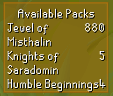
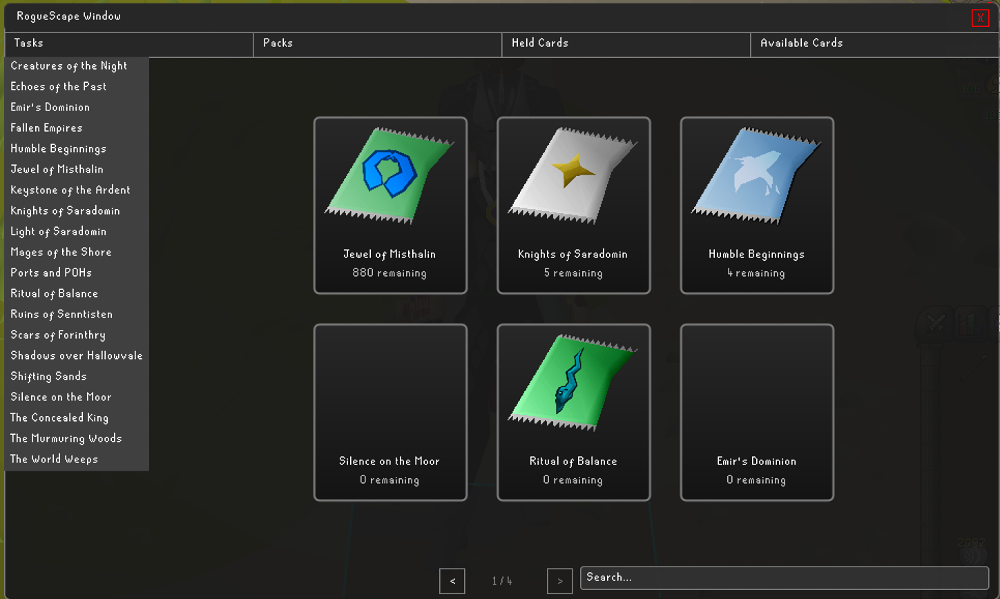
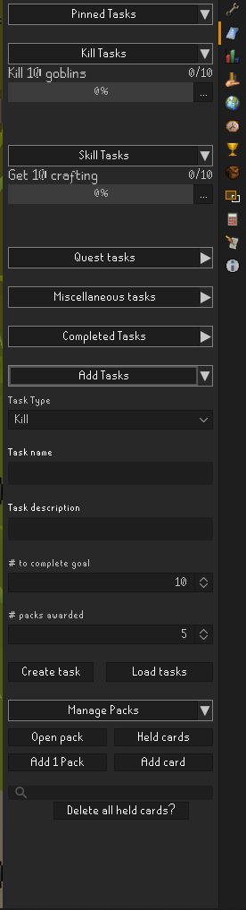
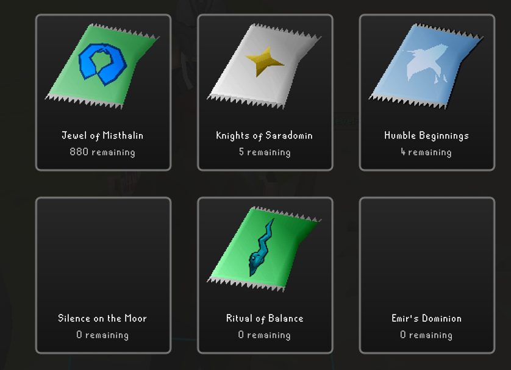
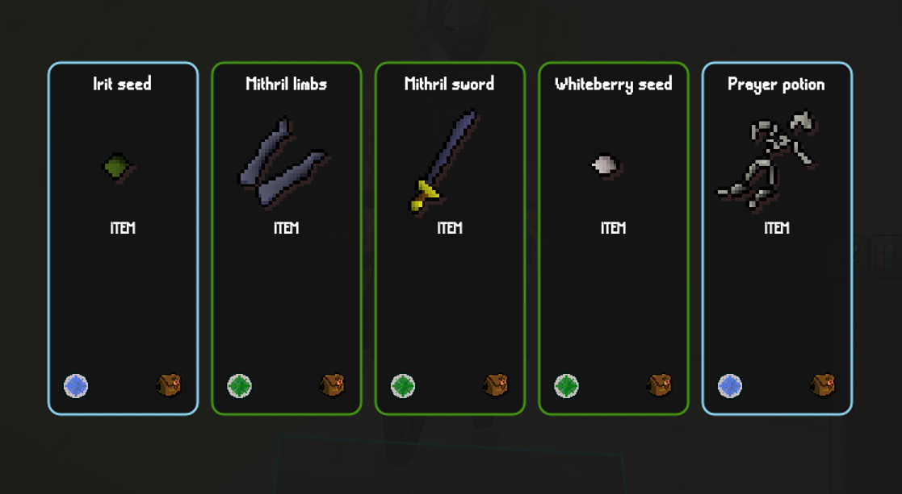
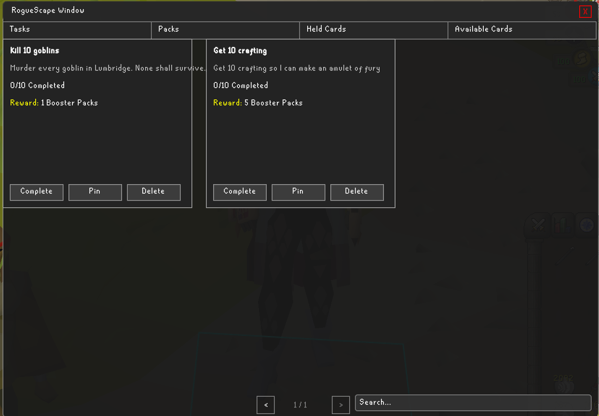
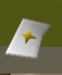

# RogueScape

RogueScape is a plugin that brings Rogue-like systems to OSRS. Inspired by MoodyYT's series "RogueScape", this plugin
was created to help him and anyone else create their own rogue-like runs of OSRS.

## What does RogueScape do?

RogueScape introduces several systems to OSRS:

* **Tasks** to complete
* **Packs** to earn and open
* **Cards** to collect

These systems are connected, creating a loop like:

> Complete tasks → Earn packs → Open packs → Collect cards → Repeat

---

## Main Features

### Custom Window Interface

The plugin adds a large in-game window where you can:

- View your tasks
- Open packs
- See your cards
- Switch between tabs

Everything is contained in one place so it’s easy to navigate. To open the window, click the pinned task overlay in the
top left corner of the window

*Click this to open the below window*

---

### Sidebar Manager

The plugin also has a manager in the sidebar to help manage tasks, packs, and cards. The plan is to eventually migrate
all the sidebar functionality to the window overlay.

### Packs

Packs are how a user unlocks new cards to add to their run. When a user completes a task, a pack will be awarded for the
area that a user is currently in (more on that later). Opening a pack will offer 5 different cards from which a user can
choose only 1. Each pack offers different cards, so choosing which area to complete a task in is part of the challenge!

---

### Cards

These are the bread and butter of the plugin. Cards are how a user unlocks new items, areas, quests, skills and more.
Each card possesses a rarity indicated by their border and rarity icon. Currently, rarity does not effect drop rate (but
it is cool looking 🙂)

---

### Tasks

Tasks are objectives set by the user that award packs. A user can create and track their progress on any task
imaginable. Currently, there are a few specific tasks such as Kill, Skill, Quest and Miscellaneous. There are no hard
restrictions for what you label things, it mostly helps with organization (for now).

There is an option to load tasks from a csv located in the sidebar menu under the "Add Tasks" section. Using this option
will delete all the current and saved tasks, so use it carefully. To create the default csv, click the button, let it
run, and then look in the location the window tells you it will read from. It should be something like C:
\Users\{username}\.runelite\plugins\roguescape\tasks.csv.

---

### Search

You can search through your items (cards, tasks, etc.) using a search bar in the UI to quickly find what you’re looking
for.

---

### Location Based Pack Unlocks

When completing a task, the plugin will automatically add an available pack. This is done by mapping the current chunk a
user is located in to a corresponding pack. In other words, when you complete a task in Falador (or Falador area
chunks), an available pack will be added to the Falador pack.

To see which pack completing a task will add to, look at the bottom left of the game, just above the chat window. You
should see a pack icon displayed, indicating the pack that will be added to.

*Falador pack icon indicating completing a task here will add an available pack to Falador*

---

## Current Status

This plugin is still being actively developed. Core systems are working, and more features are being added over time.
Please submit any bugs, features, or questions via the issues tab in this repository.

---

## To Do

* Add automatic tracking for kill and skill tasks
* Add Relics and Boons
* Improved UI and visuals

---

## Notes

This is a personal project and a work in progress. Things may change frequently as new ideas are tested and added.

---

## License

TBD
